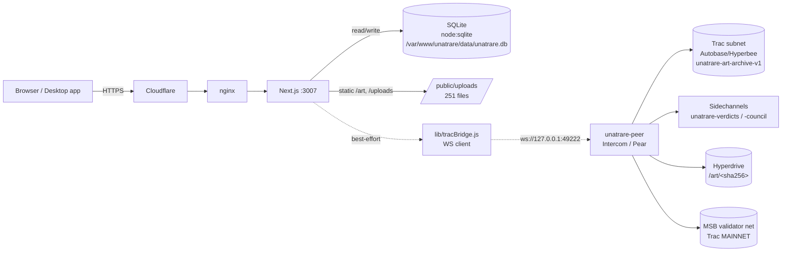

# UNATRARE — TRAC / Intercom Subnet Handoff (for Claude)

**Purpose:** everything needed to build the P2P marketplace **on the Trac subnet**. This is research +
ground truth gathered live from the code and the production server on 2026-09-25. It pastes the **real
files** (not summaries) for the UNATRARE-specific pieces, and references the generic Intercom framework
files by path + line count (they are unmodified upstream, in the `unatrare-intercom` repo).

Companion docs already in this repo root: `HANDOFF-MARKETPLACE-BUILD.md` (web marketplace phases),
`HANDOFF-CHECKOUT.md` (multi-currency checkout).

> **Security note (read first).** This repo (`github.com/joeatang/UNATRARE`) is **PUBLIC**. Secrets in this
> doc are **redacted** with `<REDACTED …>`. One secret is *already* leaked in the repo history: the
> `SC_BRIDGE_TOKEN` is hardcoded in `ecosystem.config.cjs` (and a preflight snapshot). It only guards a
> **localhost-bound** WebSocket (`ws://127.0.0.1:49222`, never internet-exposed), so blast radius is low —
> but it should be **rotated** (`openssl rand -hex 32`), moved to `.env.local` only, and scrubbed from the
> committed config. See §9 TODOs.

---

## 0. TL;DR — the three things that matter

1. **`unatrare-peer` crash-loops because its app source was deleted from the server.**
   `/var/www/unatrare/intercom/` on prod contains **only `node_modules/` + `stores/`** — the actual app
   (`package.json`, `index.js`, `contract/`, `features/`, `welcomes/`) is **gone**. `pear run .` has nothing
   to load → `✖ ERR_OPERATION_FAILED: Error: Cannot find module '/intercom'` → **70,395 restarts** and
   counting. Root cause = the web repo's `ops/deploy.sh` runs `git stash push -u`, which sweeps **untracked**
   files; `intercom/` is a *separate* repo living inside the web checkout, so its non-ignored source got
   stashed away while `node_modules/`+`stores/` (gitignored) survived. **Full diagnosis + fix in §2.**

2. **The subnet is essentially dormant / not on the live critical path.** The Next.js app records nodes,
   cards, verdicts, listings, orders, reputation in **server-side SQLite** (`node:sqlite`). It only *mirrors*
   verdicts/council to the subnet **sidechannels** over SC-Bridge as a best-effort broadcast, and *would*
   store art blobs in a Hyperdrive — but since the peer is down, none of that is happening right now. The
   subnet **contract** (`register_node` / `certify_card` / `heartbeat`) has **never been the source of
   truth**; the app uses HTTP + SQLite instead. See §3 (data model) and §6 (files).

3. **Subnet identity is inconsistent across three places** — pick ONE before building. `unatrare-keys.json`
   says channel `unatrare-v1` / bootstrap `1ea28e3d…`; `README.md` (node runner) says bootstrap `38a1b001…`;
   the **actually-running** server peer uses channel `unatrare-art-archive-v1` with **no `--subnet-bootstrap`**
   (so it bootstrapped itself as its own admin writer, pubkey `147a9694…`). See §4.

---

## 1. Architecture map — which machine runs what

Two machines:

- **Cloud VPS `root@unatrare.wtf`** (Ubuntu, UTC, Node 22, pm2) — runs the website + all always-on services.
  Web app at `/var/www/unatrare` (this repo's checkout). Downloads served from
  `/var/www/unatrare/public/downloads/` via an nginx `alias`.
- **The Mac** (`/Users/joeatang/UNATRARE/…`) — dev + the desktop-app build/sign machine + the OTA staging
  machine (holds the Pear OTA secret key). Not part of the live request path.

### pm2 processes on the server (live, 2026-09-25)

| id | name | state | what it does |
|----|------|-------|--------------|
| 3 | `unatrare` | online 5h | **Next.js production** server (`next start -p 3007`). The website. |
| 5 | `unat-seeder` | online 4h | **Desktop OTA seeder** — `pear seed pear://y9dd5w9…`. Serves the desktop auto-update drive. (Do **not** confuse with the trac seeders.) |
| 4 | `unatrare-artdrive` | online 4d | **Standalone art seeder** — `node seed-artdrive.mjs`. A Hyperdrive that serves the 249-ish certified-art files P2P (drive key `c55408ba3cbcdd310e5da40d9419c458d8545a985fa30e7c98c402988310e7dc`). **NOTE:** its script `seed-artdrive.mjs` was *also* swept from disk; it survives only because it was already running — it will **not** restart cleanly. |
| 2 | `unatrare-tgbot` | online 13d | Telegram bot (`/u`, leaderboards, dispenser scanner). Healthy. |
| 1 | `unatrare-peer` | **crash-loop** (70,395 ↺) | The **Trac Intercom peer** (SC-Bridge for verdict/council broadcast + subnet contract + art Hyperdrive). **BROKEN — see §2.** |
| 0 | `unatrare-seeder` | **crash-loop** (39,5xx ↺) | Older `seeder/seed.js` — its `seed.js` was also swept (`seeder/` now holds only `node_modules`). Superseded by `unatrare-artdrive`. Safe to `pm2 delete`. |

> Per `HANDOFF-MARKETPLACE-BUILD.md`, the standing rule was "leave `unatrare-peer`/`unatrare-seeder` alone
> (crash-looping trac peers)." This handoff explains **why** they crash and how to actually fix vs. retire them.

### Data flow



The dotted path (Next.js → tracBridge → peer → subnet) is **best-effort and currently dead** (peer down).
The solid paths (SQLite + disk) are the live source of truth and are unaffected by the peer being down —
`lib/tracBridge.js` fails **silently** when the peer is unreachable (by design).

---

## 2. THE CRASH-LOOP — real error + diagnosis + fix

### The actual error (from `pm2 logs unatrare-peer --lines 120 --nostream`)

```
1|unatrare | ✖ ERR_OPERATION_FAILED: Error: Cannot find module '/intercom'
1|unatrare |     at DependencyStream._resolveModule (…/pear/…/boot.bundle/node_modules/dependency-stream/index.js:137:17)
1|unatrare |     at async DependencyStream._open (…/dependency-stream/index.js:54:19)
1|unatrare |     at Command.run [as _runner] (…/boot.bundle/cmd/run.js:186:11)
1|unatrare |     at async runAsync (…/paparam/index.js:902:5)
```
…repeated forever (this is the entire log — it never gets past boot).

### Why (confirmed on the box)

- `pm2 describe unatrare-peer` → `exec cwd = /var/www/unatrare/intercom`, `pm_exec_path = /usr/bin/pear`,
  args `["run",".", …]`.
- **`/usr/bin/pear` is a genuine Holepunch Pear** (npm-global; `#!/usr/bin/env node` → symlinks to
  `…/node_modules/pear/pear.js`, pulls in `hypercore-id-encoding`). It is **NOT** the PHP-PEAR shim that
  earlier notes worried about. So the binary is fine.
- `ls -la /var/www/unatrare/intercom` shows **only** `node_modules/` (root, May 12) and `stores/` (root,
  May 9). **No `package.json`, no `index.js`, no `contract/`, no `features/`, no `welcomes/`.** `grep main
  package.json` → empty (file absent).
- So `pear run .` has no app manifest to resolve → boot's `DependencyStream` fails resolving the app entry
  (surfaced as the misleading `Cannot find module '/intercom'`). It exits; pm2 restarts; repeat 70k×.

### Root cause (the mechanism)

`intercom/` is its **own** git repo (`github.com/joeatang/unatrare-intercom`) that physically sits **inside**
the web repo checkout at `/var/www/unatrare/intercom`. The web deploy (`ops/deploy.sh`) does
`git stash push -u` before pulling. `-u` stashes **untracked** files — which includes all of intercom's
source (it's untracked *from the web repo's perspective*). `node_modules/` and `stores/` are gitignored in
the web repo, so `-u` left them alone. Net effect: **a web deploy silently deleted the peer's source code.**
The saved pm2 invocation even references `--sidechannel-welcome …/welcomes/verdicts.b64` — those `welcomes/`
files are gone too.

### Fix options (pick one — do NOT do this blind; confirm with Joe)

- **A. Retire it (fastest, zero risk).** The website does not need the peer — verdicts persist to SQLite and
  the browser SSE stream (`/api/events`) drives real-time UI. Run `pm2 delete unatrare-peer unatrare-seeder
  && pm2 save`. Stops the 70k-restart churn immediately. Re-introduce a peer later when the subnet is
  actually load-bearing.
- **B. Redeploy the source + isolate it from the web deploy.** `git clone github.com/joeatang/unatrare-intercom`
  to a path **outside** `/var/www/unatrare` (e.g. `/opt/unatrare-intercom`), `npm install`, restore
  `welcomes/*.b64`, point the pm2 app's `cwd` there, use an **absolute** app path in `pear run <abs-path>`
  (not `.`), and pin `pear` to `/root/.config/pear/bin/pear`. Because it's outside the web checkout,
  `git stash -u` can never sweep it again. Then `pm2 save`.
- **C. If it must live inside `/var/www/unatrare`,** add `intercom/` to the web repo's `.gitignore` **and**
  change `ops/deploy.sh` to not `-u`-stash it (e.g. `git stash push` without `-u`, or explicitly exclude the
  path). Otherwise every deploy re-deletes it.

> Recommendation: **A now** (stop the churn), then **B** when the subnet becomes real for the marketplace.

---

## 3. What lives ON the subnet vs. NOT (data model — the important part for you)

**On the server SQLite only (`/var/www/unatrare/data/unatrare.db`, `node:sqlite`, WAL) — the live source of truth:**
- **Marketplace: listings, quotes, orders (`checkout_orders`), release intents, offers, auctions, messages,
  reputation** — **100% SQLite. None of this is on the subnet.** (See `lib/market/*`, `app/api/market/*`.)
- Nodes registry (`/api/nodes/register` + `/heartbeat`), certified cards + CIP-25 metadata, verdicts, salutes,
  rewards ledger — all SQLite.

**On disk (server):**
- **Art files: `/var/www/unatrare/public/uploads/` — 251 files** (`<sha256>_card.jpg` + `<sha256>_icon.png`
  per token). Served statically by Next/nginx. **This is the art source of truth.**

**On the subnet (when the peer runs — currently down):**
- **Subnet contract state** (Autobase/Hyperbee under `stores/unatrare-admin/`): `nodes/{addr}`, `nodes_list`,
  `cards/{token}`, `cards_list`, `admin_address`, `currentTime`. This is a **parallel, mostly-unused mirror** —
  the app never made it authoritative.
- **Sidechannels** `unatrare-verdicts`, `unatrare-council`: **ephemeral** real-time broadcasts (not storage).
- **Hyperdrive** `/art/<sha256>`: intended P2P copy of approved art. The intercom peer's `artdrive` feature
  has **no store on disk** (`stores/*/artdrive` doesn't exist) → it was never populated. The *separate*
  `unatrare-artdrive` seeder (pm2 id 4) is the one actually serving art P2P.
- **MSB wallet state** (`stores/unatrare-admin-msb/`): the peer's settlement identity on Trac MAINNET.
  Unfunded (see §5).

**Implication for building the marketplace on the subnet:** today it is a **Web2 app with an optional P2P
mirror**. Moving listings/orders/reputation onto the subnet contract is **greenfield** — the contract
(`contract/contract.js`) currently only knows `nodes` + `cards`. You would extend that contract pair with
marketplace ops (and decide MSB-settled `/tx` vs. Feature-based writes; see §5).

---

## 4. Subnet identity — reconcile before you build

| Source | channel | bootstrap / writer | notes |
|--------|---------|--------------------|-------|
| `unatrare-keys.json` | `unatrare-v1` | `subnet_bootstrap = 1ea28e3d…` (= admin `peer_writer_key`) | Original design identity. Admin pubkey `8ab9982e…`, trac addr `trac132ues…`. |
| `README.md` (public node runner) | `unatrare-art-archive-v1` | `--subnet-bootstrap 38a1b001756148f3f96f8cff7bd38d2924669f5c1880b4f779512d6449cfff56` | What outside operators are told to join. |
| **Live server peer** (pm2 saved args) | **`unatrare-art-archive-v1`** | **none** (`--subnet-bootstrap` absent) | So it self-bootstrapped as its **own admin writer**. Its wallet pubkey is `147a9694a2ec55f444649f733d221a9a1879892cf1c6dfe360645ac33c46220a` (used as the `--sidechannel-owner` for verdicts/council). |

**The ADMIN / WRITER authority = the anti-sybil gate.** In this contract, the "admin" is the sole autobase
writer, set once at first boot via the `AdminBootstrap` feature → `admin_address` in contract state. Only that
address can `certify_card`. That is the Council/curation gate. On the **live** subnet the admin authority is
the server peer's own key (`147a9694…`), because it booted with no external bootstrap. If you standardize on
the keys.json identity (`unatrare-v1` / `1ea28e3d…` / admin `8ab9982e…`) you must **re-stage a fresh subnet**
or migrate — you can't retroactively change a running autobase's admin.

> **Version-lock caveat (from Intercom SKILL.md):** once a contract app is published, **all peers + indexers
> must run the exact same contract version**, or state diverges with `INVALID SIGNATURE`. Any marketplace
> contract change is a coordinated redeploy.

Stores on disk (server): `stores/unatrare-admin/` (peer/subnet state) and `stores/unatrare-admin-msb/`
(MSB wallet). Store names are set by `--peer-store-name unatrare-admin` / `--msb-store-name unatrare-admin-msb`.

---

## 5. Trac / MSB status

- **Is an MSB running?** The peer *starts* a `MainSettlementBus` on Trac **MAINNET** (`MSB_ENV.MAINNET`) at
  boot and connects to the public validator network — but since the peer is crash-looping, **no MSB is
  currently live**. There is **no local/standalone MSB**; it's the real mainnet bus.
- **$TNK / $TRAC funding requirement — yes, and unmet.** `unatrare-keys.json` note: *"MSB wallet needs TNK to
  execute contract transactions (0.03 TNK each). Fund `trac_address` before enabling `/tx`."* The MSB address
  is `trac1sxs75m5hz0gq6zxcqn5n08auszlteytzv9s7g8h97h5s2ukn7rmq749lxj` (peer) / keys.json admin
  `trac132uestkxmmyj7xsk7rg36pwtfmn5ga6jgp0cmrlee7w8pe9ckxhsagr2q9`. **These are unfunded.** So any real
  `/tx` contract op (register/certify/heartbeat *through the contract*) would fail today for lack of TNK.
- **How the app dodged that:** it never calls `/tx`. `register_node`/`heartbeat` happen over **HTTP → SQLite**
  (`/api/nodes/*`), and `admin_bootstrap`/`timer` use the **Feature** mechanism (`peer.base.append` directly),
  which works for the sole writer **without MSB**. So the live product has **no TNK dependency**. If you push
  marketplace settlement onto MSB-settled `/tx`, you take on the TNK funding requirement — budget for it, or
  keep writes on the Feature/writer path (admin-signed) and settle value off-subnet (BTC/XCP/SOL as today).
- **Standalone vs mainnet:** `unatrare-art-archive-v1` is a **standalone subnet** (its own admin writer /
  autobase) that is *attached to* Trac **MAINNET** only for the MSB settlement plane. It is **not** joined to
  any larger app's state. Bootstrap = the admin writer key (see §4).

---

## 6. The real files

Everything below is pasted verbatim from the working tree on the Mac
(`/Users/joeatang/UNATRARE/intercom` and `…/app/lib`). The **generic Intercom framework** files are large and
unmodified upstream; they are **referenced** at the end of this section with path + line count (get them from
`github.com/joeatang/unatrare-intercom`). Everything **UNATRARE-specific** is pasted in full.

### 6.1 `contract/contract.js` — the subnet contract (FULL — this is what you extend for the marketplace)

```js
import {Contract} from 'trac-peer'

/**
 * UNATRARE Contract — TRAC R1 Subnet
 *
 * State layout:
 *   admin_address          : string  — address of the bootstrap admin (set once)
 *   currentTime            : number  — ms timestamp fed by the Timer feature (admin node)
 *   nodes/{address}        : object  — { btc_address, registered_at, last_heartbeat, total_heartbeats, is_genesis }
 *   nodes_list             : array   — ordered list of registered node addresses
 *   cards/{token_name}     : object  — { token_name, art_hash, certified_at }
 *   cards_list             : array   — ordered list of certified token names
 *
 * Rules:
 *   - admin_bootstrap   : feature-based; sets admin_address on first boot (no MSB needed)
 *   - certify_card     : admin only
 *   - register_node    : anyone, once per address; first 21 earn genesis status (2× reward)
 *   - heartbeat        : registered nodes only; rate-limited to 1 per hour via Timer oracle
 *   - get_*            : read-only helpers (no state writes)
 *
 * Contract invariants (enforced by trac-peer):
 *   No try-catch · No throws · No random values · No HTTP calls · No Date.now()
 *   All time values come from the Timer feature oracle stored in 'currentTime'.
 */
class UnatrareContract extends Contract {
    constructor(protocol, options = {}) {
        super(protocol, options);

        // ── No-payload functions ──────────────────────────────────────────────
        this.addFunction('heartbeat');
        this.addFunction('getAllNodes');
        this.addFunction('getAllCards');
        this.addFunction('getNetworkSnapshot');

        // ── Schema-validated functions ────────────────────────────────────────
        this.addSchema('certifyCard', {
            value: {
                $$strict: true,
                $$type: 'object',
                op:         { type: 'string', min: 1, max: 128 },
                token_name: { type: 'string', min: 1, max: 21, pattern: /^[A-Z0-9.]+$/ },
                art_hash:   { type: 'string', min: 64, max: 64, pattern: /^[a-fA-F0-9]+$/ },
            }
        });

        this.addSchema('registerNode', {
            value: {
                $$strict: true,
                $$type: 'object',
                op:          { type: 'string', min: 1, max: 128 },
                btc_address: { type: 'string', min: 20, max: 100 },
            }
        });

        this.addSchema('getNodeState', {
            value: {
                $$strict: true,
                $$type: 'object',
                op:     { type: 'string', min: 1, max: 128 },
                pubkey: { type: 'string', min: 1, max: 256 },
            }
        });

        this.addSchema('getCard', {
            value: {
                $$strict: true,
                $$type: 'object',
                op:         { type: 'string', min: 1, max: 128 },
                token_name: { type: 'string', min: 1, max: 21 },
            }
        });

        // ── Timer feature (currentTime oracle — only active on admin node) ────
        this.addSchema('feature_entry', {
            key:   { type: 'string', min: 1, max: 256 },
            value: { type: 'any' },
        });

        const _this = this;
        this.addFeature('timer_feature', async function () {
            if (false === _this.check.validateSchema('feature_entry', _this.op)) return;
            if (_this.op.key === 'currentTime') {
                await _this.put('currentTime', _this.op.value);
            }
        });

        // ── Admin bootstrap feature — sets admin_address on first boot ────────
        // Triggered by AdminBootstrap feature in index.js on the writable node.
        // Does NOT go through MSB; works immediately for the sole writer.
        this.addFeature('admin_bootstrap_feature', async function () {
            if (_this.op.key !== 'adminPubkey') return;
            const existing = await _this.get('admin_address');
            if (null !== existing) return; // already bootstrapped; idempotent
            const pubkey = _this.op.value;
            if (typeof pubkey !== 'string' || pubkey.length < 16) return;
            await _this.put('admin_address', pubkey);
            console.log('[unatrare] Admin bootstrapped via feature:', pubkey.slice(0, 8) + '...');
        });
    }

    // ── Certify a card (admin only) ───────────────────────────────────────────
    async certifyCard() {
        const adminAddress = await this.get('admin_address');
        if (adminAddress !== this.address) return; // caller is not admin

        const tokenName = this.value.token_name;
        const artHash   = this.value.art_hash.toLowerCase();

        const existing = await this.get('cards/' + tokenName);
        if (null !== existing) return; // already certified; idempotent

        const currentTime = await this.get('currentTime');
        const card = {
            token_name:   tokenName,
            art_hash:     artHash,
            certified_at: currentTime ?? null,
        };

        const cardsList    = (await this.get('cards_list')) ?? [];
        const updatedCards = this.protocol.safeClone(cardsList);
        this.assert(updatedCards !== null);
        updatedCards.push(tokenName);

        await this.put('cards/' + tokenName, card);
        await this.put('cards_list', updatedCards);
        console.log('[unatrare] Card certified:', tokenName, artHash.slice(0, 8) + '...');
    }

    // ── Register as a network node ─────────────────────────────────────────────
    async registerNode() {
        const existing = await this.get('nodes/' + this.address);
        if (null !== existing) return; // already registered; idempotent

        const btcAddress  = this.value.btc_address;
        const currentTime = await this.get('currentTime');
        const nodesList   = (await this.get('nodes_list')) ?? [];
        const isGenesis   = nodesList.length < 21; // first 21 nodes earn genesis 2× reward rate

        const node = {
            btc_address:      btcAddress,
            registered_at:    currentTime ?? null,
            last_heartbeat:   null,
            total_heartbeats: 0,
            is_genesis:       isGenesis,
        };

        const updatedNodes = this.protocol.safeClone(nodesList);
        this.assert(updatedNodes !== null);
        updatedNodes.push(this.address);

        await this.put('nodes/' + this.address, node);
        await this.put('nodes_list', updatedNodes);
        console.log('[unatrare] Node registered:', this.address, isGenesis ? '(GENESIS)' : '');
    }

    // ── Heartbeat (registered nodes only, max once per hour) ─────────────────
    async heartbeat() {
        const node = await this.get('nodes/' + this.address);
        if (null === node) return; // not registered; ignore

        const currentTime = await this.get('currentTime');
        const HOUR_MS     = 3_600_000;

        // Rate limit: enforce 1-hour gap when the timer oracle is active
        if (currentTime !== null && node.last_heartbeat !== null) {
            if (currentTime - node.last_heartbeat < HOUR_MS) return;
        }

        const updated = this.protocol.safeClone(node);
        this.assert(updated !== null);
        updated.last_heartbeat   = currentTime ?? null;
        updated.total_heartbeats = (node.total_heartbeats || 0) + 1;

        await this.put('nodes/' + this.address, updated);
        console.log('[unatrare] Heartbeat from', this.address.slice(0, 8) + '...', '| total:', updated.total_heartbeats);
    }

    // ── Read: single node state ────────────────────────────────────────────────
    async getNodeState() {
        const pubkey = this.value?.pubkey;
        if (!pubkey) return;
        const node = await this.get('nodes/' + pubkey);
        console.log('[unatrare] node/' + pubkey.slice(0, 8) + '...:', node);
    }

    // ── Read: all registered node addresses ───────────────────────────────────
    async getAllNodes() {
        const nodesList = await this.get('nodes_list');
        console.log('[unatrare] nodes (' + (nodesList?.length ?? 0) + '):', nodesList);
    }

    // ── Read: single certified card ────────────────────────────────────────────
    async getCard() {
        const tokenName = this.value?.token_name;
        if (!tokenName) return;
        const card = await this.get('cards/' + tokenName);
        console.log('[unatrare] card/' + tokenName + ':', card);
    }

    // ── Read: all certified token names ───────────────────────────────────────
    async getAllCards() {
        const cardsList = await this.get('cards_list');
        console.log('[unatrare] cards (' + (cardsList?.length ?? 0) + '):', cardsList);
    }

    // ── Read: network summary ──────────────────────────────────────────────────
    async getNetworkSnapshot() {
        const nodesList   = await this.get('nodes_list');
        const cardsList   = await this.get('cards_list');
        const currentTime = await this.get('currentTime');
        const admin       = await this.get('admin_address');
        console.log('[unatrare] snapshot:', {
            nodes:       nodesList?.length ?? 0,
            cards:       cardsList?.length ?? 0,
            currentTime: currentTime ?? null,
            admin:       admin ? admin.slice(0, 8) + '...' : null,
        });
    }
}

export default UnatrareContract;
```

### 6.2 `contract/protocol.js` — tx command mapping + read API (UNATRARE portion, FULL)

The first ~230 lines below are the UNATRARE-specific protocol surface (this is what you extend with
marketplace commands). Lines ~230–586 of the real file are **generic Intercom sidechannel CLI handlers**
(`/sc_join`, `/sc_send`, `/sc_open`, `/sc_invite`, `/sc_welcome`, `/sc_stats`) — standard framework code,
identical to upstream; grab them from the repo if needed (`intercom/contract/protocol.js`, 586 lines total).

```js
import {Protocol} from "trac-peer";
import { bufferToBigInt, bigIntToDecimalString } from "trac-msb/src/utils/amountSerialization.js";
import b4a from "b4a";
import PeerWallet from "trac-wallet";
import fs from "fs";

// (helpers: stableStringify, normalizeInvitePayload, normalizeWelcomePayload,
//  parseInviteArg, parseWelcomeArg — sidechannel invite/welcome plumbing, generic Intercom)

class UnatrareProtocol extends Protocol {
    constructor(peer, base, options = {}) {
        super(peer, base, options);
    }

    // Read helpers exposed for SC-Bridge / Next.js API queries.
    async extendApi() {
        const self = this;
        this.api.getNodeData  = async (pubkey) => self.getSigned('nodes/' + pubkey);
        this.api.getNodesList = async ()       => self.getSigned('nodes_list');
        this.api.getCardsList = async ()       => self.getSigned('cards_list');
        this.api.getCardData  = async (token)  => self.getSigned('cards/' + token);
        this.api.getSnapshot  = async ()       => ({
            nodes: (await self.getSigned('nodes_list'))?.length ?? 0,
            cards: (await self.getSigned('cards_list'))?.length ?? 0,
            currentTime: await self.getSigned('currentTime'),
        });
    }

    // Map an incoming /tx --command string to a contract function.
    // ADD MARKETPLACE OPS HERE (e.g. list_item / buy_item / settle_order) + matching
    // functions in contract.js + schemas.
    mapTxCommand(command) {
        const obj = { type: '', value: null };

        // No-payload commands
        if (command === 'heartbeat')            { obj.type = 'heartbeat';           return obj; }
        if (command === 'get_all_nodes')        { obj.type = 'getAllNodes';         return obj; }
        if (command === 'get_all_cards')        { obj.type = 'getAllCards';         return obj; }
        if (command === 'get_network_snapshot') { obj.type = 'getNetworkSnapshot';  return obj; }

        // JSON payload commands
        const json = this.safeJsonParse(command);
        if (json.op === 'certify_card')   { obj.type = 'certifyCard';   obj.value = json; return obj; }
        if (json.op === 'register_node')  { obj.type = 'registerNode';  obj.value = json; return obj; }
        if (json.op === 'get_node_state') { obj.type = 'getNodeState';  obj.value = json; return obj; }
        if (json.op === 'get_card')       { obj.type = 'getCard';       obj.value = json; return obj; }

        return null;
    }

    async printOptions() {
        // prints the UNATRARE contract command help + system commands (/get, /msb, /sc_*)
    }

    // customCommand(input): implements /get, /msb, and the generic /sc_* sidechannel
    // commands (join/send/open/invite/welcome/stats). ~350 lines of framework plumbing.
    async customCommand(input) { /* … see repo … */ }
}

export default UnatrareProtocol;
```

Two protocol details you'll want:
- **`/get --key "<key>" [--confirmed true|false]`** reads contract state (confirmed = signed/finalized).
- **`/msb`** prints MSB txv, the peer's MSB address + **TNK balance** + fee + connected validator count —
  this is how you check funding before enabling `/tx`.

### 6.3 `lib/tracBridge.js` — the Next.js → peer SC-Bridge client (FULL)

This is the **only** thing the web app uses to talk to the subnet. It opens a short-lived authenticated WS to
`ws://127.0.0.1:49222`, and exposes `broadcastVerdict`, `broadcastCouncilDrops`, `getArt`, `storeArt`. It is
**fail-silent**: if the peer is down or `SC_BRIDGE_TOKEN` is unset, it logs and returns `false`/`null` —
verdicts still hit SQLite and the browser gets them over SSE. **This is your integration seam for the
marketplace** (add e.g. `broadcastListing` / `getOrderProof` here, mirroring these patterns).

```js
/**
 * tracBridge.js — SC-Bridge WebSocket client for the UNATRARE Trac Network peer
 * Connects to the running Intercom peer's SC-Bridge WebSocket endpoint.
 * Fail-silent when the peer is unreachable (verdicts still write to SQLite; SSE covers UI).
 */
const SC_BRIDGE_URL   = process.env.SC_BRIDGE_URL   || 'ws://127.0.0.1:49222';
const SC_BRIDGE_TOKEN = process.env.SC_BRIDGE_TOKEN || '';   // <REDACTED — set in .env.local>
const VERDICT_CHANNEL = 'unatrare-verdicts';
const COUNCIL_CHANNEL = 'unatrare-council';

// broadcastVerdict(verdict): auth → join unatrare-verdicts → send {event:'verdict', token_name,
//   status, score, certifiedVotes, totalJudges, ts}. 8s timeout. Returns bool.
export async function broadcastVerdict(verdict) { /* WS: auth_ok → join → send → close */ }

// broadcastCouncilDrops(entries): one auth'd session, join unatrare-council, send each
//   {event:'council_drop', judge_id, judge_name, sigil, text, ts}. 10s timeout.
export async function broadcastCouncilDrops(entries) { /* … */ }

// getArt(hash): auth → {id:2, type:'get_art', hash} → resolves {data:Buffer, mime} | null.
export async function getArt(hash) { /* … */ }

// storeArt(hash, base64Data, mimeType): auth → {id:1, type:'store_art', hash, data, mime}
//   → resolves true iff reply.type === 'art_stored'. Fire-and-forget at approval time.
export async function storeArt(hash, base64Data, mimeType) { /* … */ }
```

> Full 315-line implementation is in the repo at `lib/tracBridge.js` (tracked in THIS web repo — you already
> have it on `origin/main`). The bodies are straightforward native-`WebSocket` state machines; the message
> **protocol** (auth → join → send / request-by-`id`) is what matters and is shown above + in §6.5.

### 6.4 `features/artdrive/index.js` — Hyperdrive art storage (FULL)

```js
/**
 * artdrive/index.js — Hyperdrive-based P2P art storage for UNATRARE
 * Stores approved art keyed by SHA-256 hash at /art/<hash>. Replicates to any peer with the drive key.
 * SC-Bridge commands (see index.js onUnknownCommand): store_art {hash,data(b64),mime}, get_art {hash},
 *   drive_info {} → {key}.
 */
import Feature from 'trac-peer/src/artifacts/feature.js';
import b4a from 'b4a';
import path from 'path';
import Corestore from 'corestore';
import Hyperdrive from 'hyperdrive';
import Hyperswarm from 'hyperswarm';

class ArtDrive extends Feature {
  constructor(peer, config = {}) {
    super(peer, config);
    this.key = 'artdrive';
    this.drive = null; this.store = null; this.swarm = null;
    this.storesDir = typeof config.storesDir === 'string' ? config.storesDir : 'stores/';
    this.storeName = typeof config.storeName === 'string' ? config.storeName : 'peer';
  }
  async start() {
    const storePath = path.join(this.storesDir, this.storeName, 'artdrive');
    this.store = new Corestore(storePath);
    this.drive = new Hyperdrive(this.store);
    await this.drive.ready();
    this.swarm = new Hyperswarm();
    this.swarm.on('connection', (socket) => { this.store.replicate(socket); });
    this.swarm.join(this.drive.discoveryKey, { server: true, client: true });
    const driveKey = b4a.toString(this.drive.key, 'hex');
    console.log('[artdrive] Ready. Drive key:', driveKey);
    return this;
  }
  async storeFile(hash, base64, mime) {
    if (!this.drive) throw new Error('[artdrive] Not started');
    const buffer = b4a.from(base64, 'base64');
    await this.drive.put(`/art/${hash}`, buffer, { metadata: { contentType: mime } });
    return true;
  }
  async getFile(hash) {
    if (!this.drive) throw new Error('[artdrive] Not started');
    const entry = await this.drive.entry(`/art/${hash}`);
    if (!entry) return null;
    const buf = await this.drive.get(`/art/${hash}`);
    const mime = entry.value?.metadata?.contentType || 'application/octet-stream';
    return { data: buf, mime };
  }
  getDriveKey() { return this.drive ? b4a.toString(this.drive.key, 'hex') : null; }
  async stop() { await this.swarm?.destroy(); await this.drive?.close(); await this.store?.close(); }
}
export default ArtDrive;
```

### 6.5 SC-Bridge command surface (from `index.js` — the API the web app calls)

The peer's SC-Bridge accepts, beyond the generic `auth/join/send/subscribe/ping`, these **custom** message
types (wired in `index.js` `onUnknownCommand`). These + the sidechannel `onMessage` handler are your
subnet API:

```js
// SC-Bridge custom commands (index.js → new ScBridge({ …, onUnknownCommand })):
//   { type:'store_art', hash, data(base64), mime }  → { type:'art_stored', hash }
//   { type:'get_art',   hash }                       → { type:'art_data', hash, data(base64), mime } | error 'not_found'
//   { type:'drive_info' }                            → { type:'drive_info', key }
//   { type:'query_token', token }                    → { type:'token_result', token, certified, data }
//        (server fetches https://unatrare.wtf/c/<TOKEN>.json)

// Sidechannel onMessage: on channel 'unatrare-query', payload { op:'query', token } →
//   replies { op:'result', token, certified, series, card, score } by re-broadcasting to the channel.

// Auto-registration on sidechannel ready (index.js): if --xcp-address/--btc-address set, POSTs
//   https://unatrare.wtf/api/nodes/register then /heartbeat hourly. (HTTP → SQLite, NOT the contract.)
```

Bootstrap wiring highlights (real code, `index.js`, 713 lines total):
- If `peer.base.writable` (this is the admin/bootstrap node): `addAdmin` (autobase admin) → start **Timer**
  feature (`currentTime` every 60s) → start **AdminBootstrap** feature (sets `admin_address`, MSB-free).
- Always: start **ArtDrive**, start **ScBridge** (if `--sc-bridge 1`), start **Sidechannel** (entry
  `0000intercom` + extras from `--sidechannels`).
- The MSB (`MainSettlementBus`, `MSB_ENV.MAINNET`) is created + `ready()`'d before the peer.

### 6.6 `features/admin-bootstrap/index.js` (FULL) and `features/timer/index.js` (FULL)

```js
// admin-bootstrap/index.js — sets contract admin_address on first boot WITHOUT MSB (sole-writer append).
import { Feature } from 'trac-peer';
class AdminBootstrap extends Feature {
  constructor(peer, options = {}) { super(peer, options); }
  async start() {
    const existing = await this.peer.protocol.instance.getSigned('admin_address');
    if (existing !== null) { console.log('[unatrare] Admin already bootstrapped:', String(existing).slice(0,8)+'...'); return; }
    const adminPubkey = typeof this.peer.wallet.publicKey === 'string'
      ? this.peer.wallet.publicKey : Buffer.from(this.peer.wallet.publicKey).toString('hex');
    await this.append('adminPubkey', adminPubkey);   // → contract admin_bootstrap_feature
    console.log('[unatrare] Admin bootstrap feature appended:', adminPubkey.slice(0,8)+'...');
  }
  async stop() {}
}
export default AdminBootstrap;
```
```js
// timer/index.js — the currentTime oracle (only runs on the admin/writer node).
import {Feature} from 'trac-peer';
export class Timer extends Feature {
  constructor(peer, options = {}) {
    super(peer, options);
    this.update_interval = /* ms, default */ 60_000;
  }
  async start() { while (true) { await this.append('currentTime', Date.now()); await this.sleep(this.update_interval); } }
  async stop() {}
}
export default Timer;
```

### 6.7 `start-peer.sh` (FULL) — the human run script (Mac/local)

```bash
#!/usr/bin/env bash
# UNATRARE Intercom Admin Peer. Next.js connects via ws://127.0.0.1:49222.
set -e
SCRIPT_DIR="$(cd "$(dirname "${BASH_SOURCE[0]}")" && pwd)"; cd "$SCRIPT_DIR"
export NVM_DIR="$HOME/.nvm"
if [ -s "$NVM_DIR/nvm.sh" ]; then source "$NVM_DIR/nvm.sh"; nvm use 22 --silent; fi
SC_BRIDGE_TOKEN="${SC_BRIDGE_TOKEN:-<REDACTED — openssl rand -hex 32>}"
pear run . \
  --peer-store-name    unatrare-admin \
  --msb-store-name     unatrare-admin-msb \
  --subnet-channel     unatrare-art-archive-v1 \
  --sidechannels       unatrare-verdicts,unatrare-query \
  --sc-bridge          1 \
  --sc-bridge-port     49222 \
  --sc-bridge-token    "$SC_BRIDGE_TOKEN" \
  --sidechannel-quiet  1 &
echo $! > unatrare-peer.pid; wait $!
```
> Note: `start-peer.sh` joins `unatrare-verdicts,unatrare-query`, but the **live server** peer (pm2) joins
> `unatrare-verdicts,unatrare-council` with owner-write + welcome enforcement. Reconcile the channel set when
> you rebuild the run recipe.

### 6.8 `ecosystem.config.cjs` — the `unatrare-peer` block (as committed; the LIVE saved args differ)

```js
{
  name: 'unatrare-peer',
  script: 'pear',
  args: [
    'run', '.',
    '--peer-store-name',  'unatrare-admin',
    '--msb-store-name',   'unatrare-admin-msb',
    '--subnet-channel',   'unatrare-art-archive-v1',
    '--sc-bridge',        '1',
    '--sc-bridge-port',   '49222',
    '--sc-bridge-token',  '<REDACTED>',   // ← currently a real token, committed. ROTATE + move to env.
    '--sc-bridge-cli',    '1',            // ← SKILL.md warns against for agents (prompt-injection → CLI). Prefer OFF.
    '--xcp-address',      '15w1CFYpLHWGAinTFCSy9i327FHoj5t9re',
    '--btc-address',      '15w1CFYpLHWGAinTFCSy9i327FHoj5t9re',
  ],
  cwd: '/var/www/unatrare/intercom',
  interpreter: 'none',
  env: { PATH: '/root/.config/pear/bin:…', NODE_ENV: 'production', SC_BRIDGE_TOKEN: '<REDACTED>' },
  restart_delay: 15000, max_restarts: 10, autorestart: true,
}
```
The **actual saved pm2 args** on the box additionally include
`--sidechannels unatrare-verdicts,unatrare-council`, `--sidechannel-owner …:147a9694…`,
`--sidechannel-welcome …:@./welcomes/verdicts.b64,…:@./welcomes/council.b64`,
`--sidechannel-owner-write-channels unatrare-verdicts,unatrare-council`, `--sidechannel-quiet 1`, and it does
**not** pass `--sc-bridge-cli 1` (the live one is safer than the committed config). `pm_exec_path` resolved to
`/usr/bin/pear` (the npm-global Holepunch pear). Those `welcomes/*.b64` files no longer exist on disk.

### 6.9 `unatrare-keys.json` (secrets REDACTED)

```jsonc
{
  "subnet_channel": "unatrare-v1",                 // NB: live server uses 'unatrare-art-archive-v1' (see §4)
  "admin_peer": {
    "peer_pubkey_hex":   "8ab9982ec6dec92f1a16f0d11d05cb4ee7447752405f8d8ff9cf9c70e4b8b1af",
    "peer_writer_key":   "<REDACTED — = subnet_bootstrap below; PUBLIC joiner key>",
    "trac_address":      "trac132uestkxmmyj7xsk7rg36pwtfmn5ga6jgp0cmrlee7w8pe9ckxhsagr2q9",
    "store_name":        "unatrare-admin",
    "msb_store_name":    "unatrare-admin-msb",
    "msb_address":       "trac1sxs75m5hz0gq6zxcqn5n08auszlteytzv9s7g8h97h5s2ukn7rmq749lxj",
    "msb_writer_key":    "<REDACTED — MSB authority>"
  },
  "subnet_bootstrap": "1ea28e3d…<REDACTED tail>",  // admin peer WRITER key; joiners pass via --subnet-bootstrap
  "_note_msb": "MSB wallet needs TNK to execute contract transactions (0.03 TNK each). Fund trac_address before /tx.",
  "_note_sc_bridge_token": "openssl rand -hex 32 → .env.local as SC_BRIDGE_TOKEN"
}
```
> The keys.json header says the **subnet_bootstrap / peer_writer_key is PUBLIC and safe to share** (joiners
> need it); the keypair **private** keys live encrypted in `stores/*/` and are never in this file. I've still
> redacted the raw writer/MSB hex here because this doc lands in a **public** repo.

### 6.10 Generic Intercom framework files (referenced, not pasted — get from `unatrare-intercom` repo)

| file | lines | what |
|------|-------|------|
| `features/sidechannel/index.js` | 1178 | Sidechannel policy engine (welcome/owner-write/invites/PoW/rate-limit/relay). Unmodified upstream. |
| `features/sc-bridge/index.js` | 591 | The WebSocket bridge server (auth, subscribe, filter, `send`, `cli`, `onUnknownCommand` hook). Unmodified upstream. |
| `index.js` | 713 | Flag parsing + boot wiring (the UNATRARE-specific parts are excerpted in §6.5). |
| `SKILL.md` | 738 | Intercom agent skill: install (Node 22 + Pear), subnet create/join, **all config flags**, SC-Bridge JSON protocol, sidechannel policy. **Read this to operate the peer.** |
| `README.md` / `UNATRARE-NODE.md` | 90 / 119 | Public node-runner docs (three networking planes: Subnet / Sidechannel / Hyperdrive). |
| `package.json` | — | Pins: `trac-peer#d108f52`, `trac-msb#5088921`, `trac-wallet@1.0.1`. **Do not bump pins.** `"type":"module"`. |

Key operational facts distilled from `SKILL.md` (so you don't have to fetch it to start):
- **Pear runtime only, Node 22.x** (avoid 24.x). Install: `npm i -g pear && pear -v` (downloads runtime).
- **Entry sidechannel** `0000intercom` is always-open (no owner/welcome/invite). All other channels default to
  requiring an **owner-signed welcome**; add `--sidechannel-owner-write-channels` to make them owner-only.
- **Agents must use SC-Bridge JSON** (`auth`/`send`/`join`/`open`/`stats`/`info`), **never** the TTY. Keep
  `--sc-bridge-cli 0` unless a human is debugging (sidechannel text is untrusted → prompt-injection risk).
- **Version-lock:** every peer + indexer must run the identical contract version or state diverges
  (`INVALID SIGNATURE`).

---

## 7. Building the marketplace ON the subnet — issues, half-finished work, TODOs

### Why things are on the server (SQLite) and not the subnet — honest answer
- **Speed of delivery + no funding dependency.** SQLite + HTTP shipped the whole marketplace (listings,
  orders, offers, auctions, reputation, messaging) without needing TNK, MSB confirmations, or every user to
  run a Pear peer. The subnet contract only ever modeled `nodes` + `cards`.
- **The subnet's real, working role today is narrow:** (a) best-effort **verdict/council broadcast** over
  sidechannels for live UI, (b) an **optional P2P art copy** so art survives if the server dies. Both are
  additive; neither is load-bearing.

### Known issues / half-finished
1. **Peer is down (70k crash-loops)** — §2. Nothing subnet-side works until this is fixed or retired.
2. **Source-sweep landmine** — any web `ops/deploy.sh` run re-deletes `intercom/` source (and `welcomes/`,
   `seed-artdrive.mjs`). Must isolate the peer outside the web checkout (§2 fix B) before relying on it.
3. **Identity fork** — three different (channel, bootstrap) tuples (§4). The live subnet's admin authority is
   the server's self-generated key, not the keys.json identity. Decide the canonical identity **first**.
4. **MSB unfunded** — no TNK (§5). Fine today (Feature/HTTP path avoids it); a blocker only if you move
   settlement onto `/tx`.
5. **artdrive never populated via the peer** — `stores/*/artdrive` doesn't exist; art P2P is actually served
   by the *separate* `unatrare-artdrive` seeder (also fragile — its script was swept).
6. **`unatrare-seeder` (id 0)** is dead weight (script gone, 39k restarts) — retire it.
7. **SC_BRIDGE_TOKEN committed** to a public repo (§ security note) — rotate + scrub.
8. **`--sc-bridge-cli 1`** in the committed ecosystem config — turn OFF for the always-on peer.

### If you build marketplace on the subnet — the path
1. **Stabilize the peer** (§2 fix B: clone to `/opt/unatrare-intercom`, npm install, restore `welcomes/`,
   absolute app path, `/root/.config/pear/bin/pear`, `pm2 save`). Verify SC-Bridge reachable:
   `wscat -c ws://127.0.0.1:49222` → `{"type":"auth","token":…}` → `{"type":"info"}`.
2. **Pick the canonical identity** (§4) and, if changing it, stage a fresh subnet (you cannot mutate a running
   autobase's admin).
3. **Extend the contract pair** (`contract/contract.js` + `contract/protocol.js`): add marketplace ops as new
   `addFunction`/`addSchema` + `mapTxCommand` entries (e.g. `list_item`, `reserve`, `settle_order`), keeping
   the invariants (no throws / no `Date.now()` / time via `currentTime` oracle). Decide **Feature-write
   (admin-signed, MSB-free)** vs **MSB-settled `/tx`** (needs TNK). Deploy the identical version to every peer.
4. **Bridge from Next.js** via `lib/tracBridge.js` (add `broadcast*/get*` helpers mirroring §6.3), keeping the
   **SQLite copy authoritative** and the subnet as a verifiable mirror until it's proven.
5. **Anti-sybil / Council gate = the admin writer key.** Certification (and any privileged marketplace op) must
   check `admin_address === this.address` in-contract, exactly like `certifyCard`.

---

## 8. Quick command reference (for whoever fixes the peer)

```bash
# See the crash live:
ssh root@unatrare.wtf 'pm2 logs unatrare-peer --lines 60 --nostream'

# Stop the churn now (option A):
ssh root@unatrare.wtf 'pm2 delete unatrare-peer unatrare-seeder && pm2 save'

# Proper redeploy (option B, outside the web checkout):
ssh root@unatrare.wtf '
  git clone https://github.com/joeatang/unatrare-intercom /opt/unatrare-intercom &&
  cd /opt/unatrare-intercom && npm install &&
  # restore welcomes/verdicts.b64 + welcomes/council.b64 (regenerate via /sc_welcome on the admin peer)
  export PATH=/root/.config/pear/bin:$PATH &&
  pear run /opt/unatrare-intercom --peer-store-name unatrare-admin --msb-store-name unatrare-admin-msb \
    --subnet-channel unatrare-art-archive-v1 --sc-bridge 1 --sc-bridge-port 49222 \
    --sc-bridge-token "$SC_BRIDGE_TOKEN" --sidechannel-quiet 1
'
# Then re-point the pm2 app cwd to /opt/unatrare-intercom, drop --sc-bridge-cli, pm2 save.

# Check MSB / TNK funding (once the peer runs, in its TTY): /msb
```

---

*Compiled 2026-09-25 from live code + the production server. Web repo HEAD at time of writing: `11544e7`.
Files pasted from `/Users/joeatang/UNATRARE/intercom` (repo `github.com/joeatang/unatrare-intercom`) and
`app/lib/tracBridge.js` (this repo). Nothing here was executed against prod — research only.*
